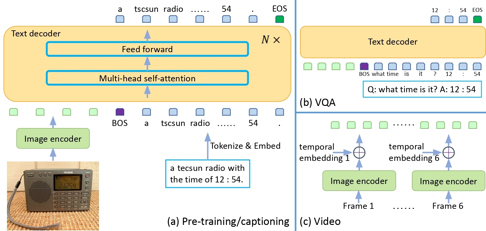

# Image to CSS style string

The problem has been formalized as image captioning problem, where given the UI image the model will generate the CSS style string. 

## Model Architecture

Generative Image to text transformer(GIT) has been finetuned on the D1, D2, D3 datasets seperately in the notebooks [d1_training.ipynb](d1_training.ipynb), [d2_training.ipynb](d2_training.ipynb), and [d3_training.ipynb](d3_training.ipynb). 

Model Architecture details:

## Set up the training environment

To setup training environment kindly follow the below steps:
1. > python3 -m venv \<path-to-env>/\<envname>
2. > source activate \<path-to-env>/\<envname>/bin/activate
3. > pip3 install -r requirements.txt

## Training model:

Model training can be done by running [d1_training.ipynb](d1_training.ipynb), [d2_training.ipynb](d2_training.ipynb), and [d3_training.ipynb](d3_training.ipynb) individually. All notebooks follow the same flow with same model architecture, only dataset is different.

Steps in notebook run:
1. Create `manifest.jsonl` file which contains the filename and corresponding caption. 
2. Used the ImageFolder feature to quickly turn this into a Huggingface 🤗 Dataset.
3. Next created standard PyTorch dataset. To preprocess the tokens we use `microsoft/git-base` auto-preprocessor. 
4. Created PyTorch dataloader. 
5. Defined the model. `microsoft/git-base` has been used as base model.
6. Trained the model.
7. Inference

> **Note** because of hardware limitations the model was trained only for one epoch. 
> having good accelerator(s) can help in training for required epochs. 
> However, it's been made sure that the code runs without any code error. 

## Evaluation

The model uses Adam with weight decay function to train and evaluate model performance. 

## Inference

The Inference code has been added in the last section of the notebook. 